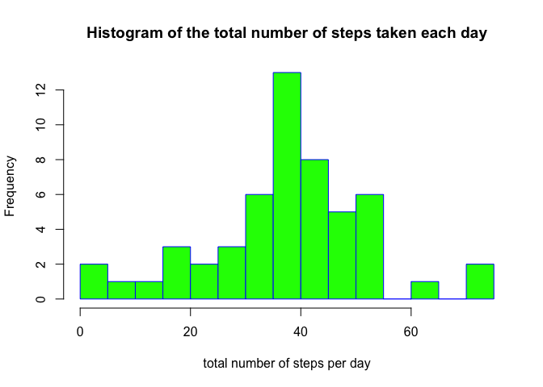
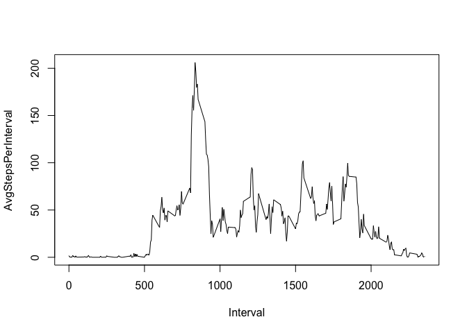
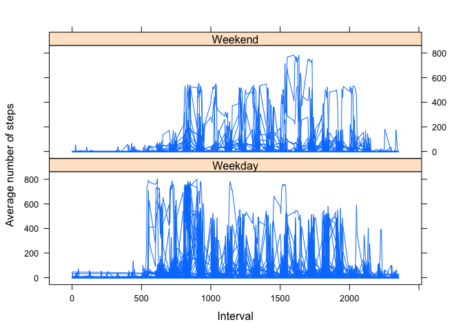

# Reproducible Research: Peer Assessment 1

## 1. Loading and preprocessing the data
1.1. read the CSV file into a dataframe called Activity  
assumption: activity.csv is in the working directory

```r
Activity<-read.csv("activity.csv")
```

## 2. What is mean total number of steps taken per day?
load Dplyr, as this is used to group and summarise the dataframe

```r
suppressMessages(library(dplyr))
```

2.1.1 use Dplyr to group the dataframe by the date coloum and store in variable tmp

```r
tmp<-dplyr::group_by(Activity, date) 
```
2.1.2 take the mean of each the steps per day and store in variable tmp2

```r
tmp2<-dplyr::summarise_each(tmp, funs(mean))
```
2.1.3 drop the third coloumn as not relevant 

```r
tmp2 <- tmp2[-3]
```
2.1.4 change the coloumn names 

```r
colnames(tmp2)<-c("Date", "AvgStepsPerDay")
head(tmp2)
```

```
## Source: local data frame [6 x 2]
## 
##         Date AvgStepsPerDay
## 1 2012-10-01             NA
## 2 2012-10-02        0.43750
## 3 2012-10-03       39.41667
## 4 2012-10-04       42.06944
## 5 2012-10-05       46.15972
## 6 2012-10-06       53.54167
```
2.2 plot histogram of tmp2

```r
    hist(tmp2$AvgSteps, 
          main="Histogram of the total number of steps taken each day", 
          xlab = "total number of steps per day",
          border="blue", 
          col="green",
          breaks=20)
```

 
2.3 Calaculate the Mean and the Median respectively 

```r
mean(Activity$steps,na.rm=TRUE)
```

```
## [1] 37.3826
```

```r
median(Activity$steps,na.rm=TRUE)
```

```
## [1] 0
```

## 3. What is the average daily activity pattern?

3.1.1 group the Activity dataframe by interval and store in new variable tmp3

```r
tmp3<-dplyr::group_by(Activity, interval)
```

3.1.2 take the mean of the steps interval and store in new variable tmp4 

```r
tmp4<-dplyr::summarise_each(tmp3, funs(mean(., na.rm = TRUE)))
tmp4 <- tmp4[-3]
colnames(tmp4)<-c("Interval", "AvgStepsPerInterval")
head(tmp4)
```

```
## Source: local data frame [6 x 2]
## 
##   Interval AvgStepsPerInterval
## 1        0           1.7169811
## 2        5           0.3396226
## 3       10           0.1320755
## 4       15           0.1509434
## 5       20           0.0754717
## 6       25           2.0943396
```

3.1.3 plot time series

```r
plot(tmp4, type="l")
```

 

3.2 find interval which has the maximum value

```r
MaxSteps<-max(tmp4$AvgSteps)
for(i in 1:288)
{
         if(tmp4$AvgSteps[i]==MaxSteps)
         {
           print(tmp4$interval[i])
         }
}
```

```
## NULL
```
## 4. Imputing missing values
4.1 the number of  NAs is  values

```r
sum(is.na(Activity$steps))
```

```
## [1] 2304
```

4.2 replace NAs with the average steps per interval over all days (this has already been claculated and stored in varibale tmp4)
4.3.1 below code empliments the above strategy (i.e. 4.2)

```r
Activity2<-Activity
for(i in 1: 17568)
{
  if(is.na(Activity2$steps[i]))
  {
  Activity2$steps[i]<-tmp4$AvgStepsPerInterval[which(tmp4$Interval==Activity2$interval[i])]
  }
}
head( Activity2)
```

```
##       steps       date interval
## 1 1.7169811 2012-10-01        0
## 2 0.3396226 2012-10-01        5
## 3 0.1320755 2012-10-01       10
## 4 0.1509434 2012-10-01       15
## 5 0.0754717 2012-10-01       20
## 6 2.0943396 2012-10-01       25
```

```r
tail( Activity2)
```

```
##           steps       date interval
## 17563 2.6037736 2012-11-30     2330
## 17564 4.6981132 2012-11-30     2335
## 17565 3.3018868 2012-11-30     2340
## 17566 0.6415094 2012-11-30     2345
## 17567 0.2264151 2012-11-30     2350
## 17568 1.0754717 2012-11-30     2355
```
4.3.2 new mean and activity with NAs substituted with values taken for average steps per interval

```r
mean(Activity2$steps)
```

```
## [1] 37.3826
```

```r
median(Activity2$steps)
```

```
## [1] 0
```

4.4 histogram

```r
hist(Activity2$steps, 
          main="Histogram of the total number of steps taken each day",
          xlab = "total number of steps per day",
          border="blue", 
          col="green",
          breaks=30)
```

 

## 5. Are there differences in activity patterns between weekdays and weekends?
5.1.1 find the day of a week in r

```r
Activity2$day <- weekdays(as.Date(Activity$date))
```

5.1.2 group by day in variable tmp99   

```r
tmp9<-dplyr::group_by(Activity2, day)
tmp99<-tmp9
```

5.1.3 classify days as weekend or weekday in new variable tmp99

```r
for(i in 1:17568)
{
  if(tmp99$day[i]=="Saturday")
  {
    tmp99$day[i]<-"Weekend"
  }
  else if(tmp99$day[i]=="Sunday")
  {
    tmp99$day[i]<-"Weekend"
  }
  else
  {
    tmp99$day[i]<-"Weekday"
  }
}
tmp99<-tmp99[,-2]
colnames(tmp99)<-c("AvgSteps", "Interval", "WeekEndDay")
head(tmp99)
```

```
## Source: local data frame [6 x 3]
## 
##    AvgSteps Interval WeekEndDay
## 1 1.7169811        0    Weekday
## 2 0.3396226        5    Weekday
## 3 0.1320755       10    Weekday
## 4 0.1509434       15    Weekday
## 5 0.0754717       20    Weekday
## 6 2.0943396       25    Weekday
```

5.2 Take the means of each variable per activity and per day  

```r
library(lattice)
xyplot(AvgSteps~Interval|WeekEndDay, 
           data = tmp99,
           type = "l",
           xlab = "Interval",
           ylab = "Average number of steps",
           layout=c(1,2))
```

 
